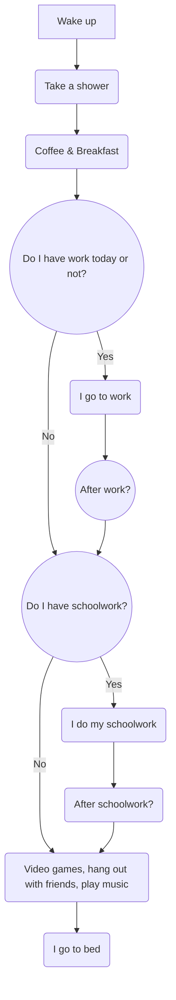

Each day, I wake up and take a shower. I have breakfast, and then my day starts. 
First, I have to see if I have work or not. If I do, I go to work. Then, I need to see if I have schoolwork. 
If I do, I complete it and do my hobbies. If I don't, then it's just hobbies. If I don't have work, I check for schoolwork.
Depending if I have some or not I either complete it and do my hobbies, or just do my hobbies.
At the end of the day I always go to bed.